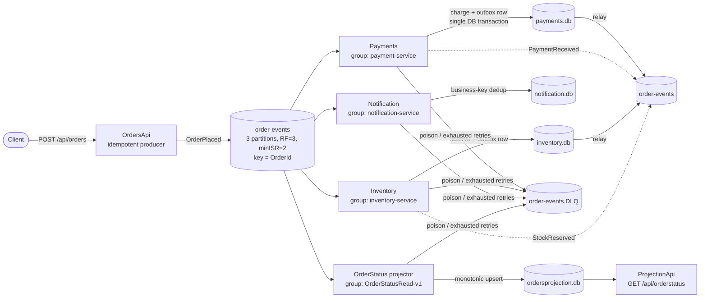

# OrderFlow

An event-driven order processing system built with **.NET 10** and **Apache Kafka**, designed to demonstrate production-grade messaging patterns — not just the happy path. Every reliability pattern in this codebase was added in response to a failure I reproduced deliberately: killed brokers, poison messages, crashed consumers mid-transaction, zombie producers, and full replays.

**Flow:** an order is placed over HTTP → `OrderPlaced` lands on Kafka → payment is processed → `PaymentReceived` → stock is reserved → `StockReserved` → notifications fire and a query-side read model is projected, all asynchronously, all surviving crashes at any step.

## Architecture



One topic, keyed by `OrderId`, so every event for a given order lands on the same partition and is consumed in order. Four independent consumer groups fan out from it — each keeps its own offsets, its own database, its own pace.

## Services

| Project                                       | Role                                                              | Key patterns                                                                               |
| --------------------------------------------- | ----------------------------------------------------------------- | ------------------------------------------------------------------------------------------ |
| `OrderFlow.OrdersApi`                         | HTTP entry point, publishes `OrderPlaced`                         | Idempotent producer (acks=all, PID+sequence), DI singleton with warm-up, broker-down → 503 |
| `OrderFlow.Payments`                          | Consumes `OrderPlaced`, charges, emits `PaymentReceived`          | Transactional outbox + relay, EventId ledger, retry + DLQ                                  |
| `OrderFlow.Inventory`                         | Consumes `PaymentReceived`, reserves stock, emits `StockReserved` | Outbox + relay, `unique(OrderId)` constraint as idempotency guard                          |
| `OrderFlow.Notification`                      | Consumes `OrderPlaced` + `PaymentReceived`, sends email           | Business-key dedup `unique(OrderId, EventName)` — replay-safe side effects                 |
| `OrderFlow.OrderStatus`                       | Projects all events into a per-order status row                   | CQRS read model, monotonic status guard, rebuildable from offset 0                         |
| `OrderFlow.ProjectionApi`                     | Serves the read model over HTTP                                   | Query side never touches Kafka                                                             |
| `OrderFlow.Contracts`                         | Avro schemas (`.avsc`) + generated classes                        | Single source of truth for the wire format                                                 |
| `OrderFlow.Common` / `Domain` / `Application` | Retry helper, Result pattern, entities, DbContexts                | Shared infrastructure                                                                      |

## Events & schema evolution

All events ride a common envelope: `EventId` (uuid), `EventName`, `OrderId`, `CustomerId`, `OccurredAt` (timestamp-millis), `EventVersion`, `CorrelationId`, `CausationId`.

- **Avro + Confluent Schema Registry** on every message — the registry rejects incompatible schemas at produce time instead of letting consumers discover them at 3 a.m.
- **`TopicRecordNameStrategy`** so multiple event types share one topic, each with its own compatibility history.
- **BACKWARD compatibility**, evolved for real: `OrderPlaced` grew `DiscountCode`, then `CorrelationId`/`CausationId` — always add-with-default, so old events still deserialize and old consumers still work.
- **Correlation/Causation tracing:** the API mints `CorrelationId`; each consumer sets `CausationId` to the EventId it is reacting to. One order = one traceable chain across every service log.
- Consumers deserialize as `GenericRecord` and dispatch on schema name; version tolerance lives in explicit mappers, and unknown event types are skipped with a metric — never treated as poison.

## Reliability patterns (and the failure each one answers)

**Transactional outbox + relay** — a service that writes a DB row _and_ publishes an event can crash between the two. Payments and Inventory write the business row and the outgoing event in **one database transaction**; a relay publishes pending rows and marks them. Verified by kill-testing: a row with `PublishedAt = NULL` survived a process kill and was published on restart. Phantom events are impossible; the relay's natural retry is the row itself.

**Idempotent consumers, two flavors** — Kafka is at-least-once, so duplicates are a _when_, not an _if_. Processing ledgers keyed by `EventId` absorb redelivery (same delivery twice); unique business keys like `unique(OrderId, EventName)` absorb _re-emission_ (same fact in a new envelope). The ledger insert and the business write share one DB transaction, so a crash between them cannot split the truth.

**Retry with classification → DLQ with evidence** — transient failures (DB busy, timeouts) retry with exponential backoff + jitter inside a per-attempt scope. Permanent failures and exhausted budgets go to `order-events.DLQ` carrying forensic headers (exception, source topic/partition/offset, attempt count, consumer group). Companion triage and re-drive tools inspect the queue and replay messages with a `redrive.attempt` odometer capped at 3 — no infinite poison loops.

**Offset discipline** — consumers use manual offset storage (`EnableAutoOffsetStore = false` + `StoreOffset` after the DB commit): a message's offset is only ever stored once its effects are durable. Crash before the store → redelivery → absorbed by the ledgers. Cooperative-sticky rebalancing keeps partition movement incremental.

**Rebuildable read model (CQRS)** — the OrderStatus projection treats the topic as the source of truth and its own SQLite table as disposable. A monotonic status guard (`OrderPlaced < PaymentReceived < StockReserved`) plus `unique(OrderId)` make the fold idempotent and order-tolerant: delete the DB, reset the group to earliest, and the table rebuilds itself.

## Infrastructure

A 3-broker **KRaft** cluster (no ZooKeeper) with combined controller/broker nodes plus Schema Registry, via Docker Compose. Durability stance: `RF=3`, `min.insync.replicas=2`, producers use `acks=all` — writes survive one broker loss and are _refused_ (never silently under-replicated) when two are down. Benchmarked the cost of that choice: acks=0/1/all measured at ~397k / 348k / 253k rec/s locally — durability is a knob you pay for, and this project pays it with eyes open.

## Running locally

```bash
# 1. Start the 3-broker cluster + Schema Registry
docker compose up -d

# 2. Create the topics
#    order-events:      3 partitions, RF=3, min.insync.replicas=2
#    order-events.DLQ:  1 partition,  RF=3

# 3. Run the services (each in its own terminal)
dotnet run --project OrderFlow.OrdersApi
dotnet run --project OrderFlow.Payments
dotnet run --project OrderFlow.Inventory
dotnet run --project OrderFlow.Notification
dotnet run --project OrderFlow.OrderStatus
dotnet run --project OrderFlow.ProjectionApi

# 4. Place an order
curl -X POST http://localhost:5028/api/orders \
  -H "Content-Type: application/json" \
  -d '{ "customerId": "cust-1", "amount": 99.5 }'

# 5. Watch it propagate, then query the read model
curl http://localhost:5159/api/orderstatus
```

## Failure experiments (selected)

This system was tested by breaking it, on purpose, with the evidence captured:

- **Broker failover from the producer's seat** — clean stop: ~2–3s transparent recovery; `kill -9`: delivery timeout surfaced at the configured budget. Same cluster, very different client experience.
- **Replicas below min.insync.replicas** — writes refused with `NOT_ENOUGH_REPLICAS` while reads kept serving; committed history frozen rather than corrupted. Healing observed live as the replica rejoined.
- **Poison message** — garbage bytes rejected by the Avro magic-byte check, parked in the DLQ with full evidence headers, re-driven after a fix.
- **Crash between DB commit and offset store** — redelivery on restart, absorbed by the EventId ledger; zero double-charges.
- **Full replay** (`--reset-offsets --to-earliest`) against Notification — every event redelivered, **zero duplicate emails**, thanks to business-key dedup.
- **Outbox kill-test** — process killed after the DB commit, before publish; the pending row survived and was relayed on restart.
- **Hung Kafka transaction** — demonstrated the LSO pinning read_committed consumers while producers keep appending ("looks like a slow consumer, isn't one").

## Known trade-offs (kept deliberately)

- **OrdersApi is not idempotent at the HTTP edge** — a client retry mints a new `EventId`. Downstream business-key ledgers absorb the duplicate _fact_; a client-supplied idempotency key is the documented next step.
- **Retry-tier topics** (`retry.5s`, `retry.1m`, …) are documented as the growth path; in-process backoff is sufficient at this scale.
- **Notification uses send-then-record** — a crash in the gap can duplicate an email; chosen over record-then-send (which can silently _drop_ one). Closing it fully requires a provider idempotency key.
- SQLite everywhere — the patterns (transactions, unique constraints, outbox) translate 1:1 to SQL Server/Postgres; the file DB keeps the demo self-contained.

## Tech stack

.NET 10 · ASP.NET Core · EF Core (SQLite) · Confluent.Kafka · Confluent Schema Registry (Avro) · Apache Kafka 3.7 (KRaft, 3 brokers) · Serilog · Docker Compose
